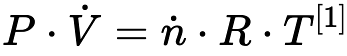

<h1 align="center"> Custom RP2040 Boost Gauge </h1>

<h4 align="center"> built with <a href="https://lvgl.io">LVGL</a> and the <a href="https://www.waveshare.com/rp2040-touch-lcd-1.28.htm">Waveshare touchscreen</a></h4>

### Overview
This is a project I took on to demonstrate programatically generated gauges on a round touchscreen with an interface built using LVGL for infite flexibility in what data is displayed and how. I learned when building my Raspberry Pi-based backup camera system that although my car has a sensor to detect intake manifold pressure, that data is not made available in the barebones OBD-II datastream. My workaround involves plugging values into the ideal gas law equation tweaked to accont for volumetric and mass flow rate. Values derived from the Mass Air Flow sensor, the Intake Air Tempterature sensor, the engine speed (RPM), and the measured atmospheric pressure along with constants like `R` and the molar mass of air can be used to determine instantaneous boost with the below equation:

I have long admired the 2013 Moto X for its early adoption of an efficiency coproccesor providing reduction in battery draw for always-on voice assistant features and there has always been something satisfying to me about hardware tailored to a particular task. With an aging Pi4 struggling to manage processing one video stream while recording another I decided to offload my car data logger display to a more suitable piece of hardware with the eventual intent of setting it up as an optionally standalone system.

This was going to be a relaxed weekend afternoon project that turned into an impromptu all-nighter. After poking at it for a few more days I ended up with a decent looking interface. Although I'm still figuring out the best implementation for using the ELMduino library to communicate with the car via the ELM327 adapter the main point was to explore the programmatic alternative to making a series of images in photopea and jamming the onboard flash full of bitmaps. I've learned a whole lot and figured I'd document this as much to show off the results as to highlight the development pitfalls and ways for others to avoid some of my own mistakes.

Some insight I gained while working with LVGL on this project includes:

- I had the choice of using the `gauge` interface from LVGL v7, or the `meter` interface from v8, but they were abstracted to the `scale` interface in v9 which provided a means of more precisely organizing and constructing my gauge interface in a programmatic way.
- To enable DMA writes on the screen there were some hardware module-specific changes that had to be made to the lv_conf.h file. I did so by modifying the existing file in the libraries subdirectory since I have no other conflicting projects but it makes more sense to set one up for each sketch.
- Googling the Audi gauge font led me to the name Microgramma, and searching for that landed me on some shady nondescript webpage from which I could download a copy. LVGL provides a [helpful tool](https://lvgl.io/tools/fontconverter) for converting font characters into `c` formatted bitmaps but for some reason each character seemed oversized and was being cut off at the trailing edge so I had to tweak the dpi settings in FontForge and eventually got things working well enough. There is a conditional import clause at the beginning of each font file that had to be removed for import to work in the Arduino IDE.
- LVGL has pretty good [documentation](https://docs.lvgl.io/master/index.html) that merits reading through before starting out as some crucial aspects of the code are not well addressed in the examples alone.

Building a custom hardware extension to support direct connection to the OBD interface with a CAN tranciever would be cool but you know what would be even cooler? Adapting an existing microcontroller-based product that already handles all physical and interface requirements for me. The ELM327 utilizes a PIC microcontroller to facilitate communication with the car via its preprogrammed standard protocols and built in connector to plug it in. Typically these convert UART to USB or some other wireless serial protocol however, bypassing that permits a direct connection with one of the RP2040 UARTs since I didn't feel like adding a USB host controller to the code overhead. Of course you can buy customizable aftermarket gauges but...

Of course it wouldn't be a project of mine without a few puzzling, headache-inducing roadblocks. Moving from a python library intended for a computer to a microcontroller library means that there's a lot less hand-holding with much more left up to the implementer. I was confused by the included convenience methods which appeared to be blocking but don't act that way in my code. It was basically Schrödinger's block. I have a rough sketch close to working and more refinements can be made to reduce power consumption with the eventual goal of putting the RP2040 in some sort of sleep state that wakes up only when sensor data becomes available to update the image. Stay tuned for updates!

### Sources & Inspiration:
1. ] https://www.first-sensor.com/cms/upload/appnotes/AN_Massflow_E_11153.pdf
1. ] https://youtu.be/pbqgrv5YSf0
    - I saw this video first, it is for a custom shift knob gear select indicator. While not the same screen it definitely got the creative gears turning so to speak. It is a video from a series detailing that extremely cool project and the creator [upir](https://www.youtube.com/@upir_upir) is worth a follow if you like cars and also gadgets.
1. ] https://youtu.be/cZTx7T9uwA4 - Boost gauge using image series
1. ] https://youtu.be/A00CvNi1rzQ - Temp gauge w different series of images
1. ] https://youtu.be/i-TA3Xwja64
    - Using the meters widget from a port of lvgl v8 to programatically generate gauges, first one I stumbled upon like this. [source](https://github.com/valentineautos/minimal-gauges-common).
1. ] https://youtu.be/y_H7HM0oyoo
    - Another set of gauges based on static images. Doesn't benefit from the configurability of lvgl instead using only the lower level TFT_eSPI driver.
1. ] https://youtu.be/gsTP7zljSBg
    - Another project based on images with more dynamic sprite utilization.
1. ] https://youtu.be/s4_fUwhw-dI - LVGL overview
1. ] https://youtu.be/mqSe_uMpxIs - Fun animated images project
1. ] https://youtu.be/g4ZVXwt5ueA
    - Generic product exposition/sponsored content for the ESP32 variety.
1. ] https://youtu.be/HzHRJd7rihE
    - Star wars tactical display was another fun diversion. Uses another lower-level graphics library and a dumb screen but the display elements are largely generated with code. Very neat project.
1. ] https://youtu.be/jis1MC5Tm8k
    - accelerometer power save idea 🤌 and also a cool project in its own right
